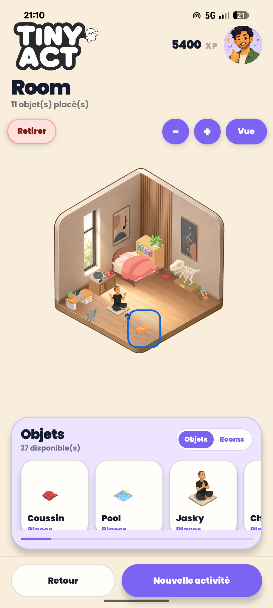

# Tiny Act

[](https://github.com/jcparfait/Tiny_act/actions/workflows/ci.yml)


**Tiny Act** est une application mobile qui aide l’utilisateur à choisir et réaliser une micro-activité adaptée à son humeur, son lieu, son temps disponible et ses centres d’intérêt.

Le projet associe une application Expo / React Native à une API Ruby on Rails. Son objectif est de transformer un moment d’inertie en petite action concrète, puis de rendre la progression visible grâce à l’XP, l’historique et une room personnalisable.

## Statut du projet

- Version mobile fonctionnelle sur la branche par défaut `main`.
- Backend Rails déployé sur Heroku avec des endpoints JSON sous `/api/v1`.
- APK Android installable générée avec EAS Build.
- Release GitHub de démonstration disponible.
- Tests Rails sur les principaux parcours API mobiles.
- Intégration continue GitHub Actions pour les tests Rails et les contrôles de qualité mobiles.

## Démonstration

- [Release GitHub v1.0.0](https://github.com/jcparfait/Tiny_act/releases/tag/v1.0.0-mobile-demo)
- [Build Android EAS](https://expo.dev/accounts/jcparfait/projects/tiny-act/builds/d46043ef-a0f3-46ff-bff9-822f29c3b5fb)
- [Télécharger directement l’APK](https://expo.dev/artifacts/eas/9RBGzWuqGBwAQI0Pgtfsj5ew1UjOBCVM4u-9tMZOgdc.apk)
- [API Heroku](https://tiny-act-513fa82ec3fd.herokuapp.com)
- [Healthcheck API](https://tiny-act-513fa82ec3fd.herokuapp.com/api/v1/health)

Compte de démonstration :

```text
Email: jc.demo@example.com
Mot de passe: 123456
```

## Captures d’écran

<p>
  
  
  
  
</p>

## Parcours produit

L’utilisateur sélectionne son humeur, son lieu et sa durée disponible. Tiny Act propose ensuite des activités compatibles avec ses centres d’intérêt. Une activité terminée rapporte de l’XP, fait progresser le centre d’intérêt associé et peut débloquer des meubles pour personnaliser la room.

Fonctionnalités principales :

- authentification mobile par compte utilisateur et token API ;
- onboarding avec sélection des centres d’intérêt et avatar ;
- recommandation selon l’humeur, le lieu, la durée et les intérêts ;
- activités guidées avec timer, pause, reprise et finalisation ;
- quiz culture et code, langues, mélodie et sport guidé ;
- historique des sessions terminées ;
- calcul d’XP centralisé côté backend ;
- progression par centre d’intérêt ;
- inventaire et room personnalisable ;
- persistance locale du token et des préférences mobiles.

## Stack technique

| Partie | Technologies |
| --- | --- |
| Mobile | Expo, React Native, TypeScript, Expo Router |
| UI mobile | Expo Image, Expo Fonts, React Native Animated, design system local |
| Auth mobile | API token, Expo Secure Store |
| Backend | Ruby on Rails 8.1, API JSON, Devise |
| Base de données | PostgreSQL |
| Données | Seeds Rails, imports CSV avec Roo |
| Tests | Minitest Rails, tests API, modèles et service XP |
| Qualité | GitHub Actions, TypeScript, ESLint, Expo Doctor, Brakeman, RuboCop |

## Architecture

```text
.
├── app/                         # Backend Rails : contrôleurs, modèles, services
├── config/routes.rb             # Routes web et API mobile /api/v1
├── db/                          # Schéma, migrations, seeds et données CSV
├── test/                        # Tests Rails et API mobile
└── mobile/                      # Application Expo / React Native
    ├── .env.example             # Exemple de configuration API
    ├── app.json                 # Configuration Expo
    ├── package.json             # Scripts et dépendances mobiles
    └── src/
        ├── app/                 # Écrans Expo Router
        ├── components/          # Composants UI
        ├── context/             # AuthContext
        ├── services/            # Clients API
        ├── theme/               # Tokens visuels
        └── types/               # Types TypeScript
```

## API mobile

Les routes principales sont exposées sous `/api/v1` :

| Domaine | Routes principales |
| --- | --- |
| Santé API | `GET /api/v1/health` |
| Auth | `POST /auth/login`, `POST /auth/register`, `GET /auth/me`, `DELETE /auth/logout` |
| Profil | `PATCH /auth/profile`, `DELETE /auth/profile` |
| Onboarding | `GET /interests`, `PATCH /interests` |
| Critères | `GET /moods`, `GET /locations`, `GET /durations` |
| Sessions | `GET /activity_sessions`, `POST /activity_sessions`, `GET /activity_sessions/:id` |
| Exécution | `PATCH /start`, `PATCH /pause`, `PATCH /resume`, `PATCH /finish` |
| Progression | `GET/PATCH /activity_sessions/:id/progress`, `GET /reward` |
| Room | `GET /room`, `POST/PATCH/DELETE /room/furnitures` |

## Installation locale

Prérequis : Ruby 3.3.5, PostgreSQL, Bundler, Node.js et `npx`.

### Backend Rails

```bash
bundle install
bin/rails db:create db:migrate db:seed
bin/rails server
```

API locale :

```text
http://localhost:3000/api/v1
```

### Application mobile

```bash
cd mobile
npm install
cp .env.example .env.local
npx expo start
```

Adapter `EXPO_PUBLIC_API_URL` dans `mobile/.env.local` si l’application tourne sur un téléphone physique.

## Tests et intégration continue

Commandes locales :

```bash
bin/rails test
bin/rails test test/controllers/api/v1
bin/rails test test/services/xp_calculator_test.rb
cd mobile && npm run typecheck
cd mobile && npm run lint
cd mobile && npm run doctor
```

Le workflow GitHub Actions exécute automatiquement les tests Rails, l’analyse de sécurité et les contrôles TypeScript / ESLint à chaque push ou pull request vers `main`.

Couverture actuelle :

- authentification mobile : inscription, connexion, token, endpoint protégé et déconnexion ;
- sélection des centres d’intérêt ;
- création et exécution d’une session d’activité ;
- attribution d’XP et lecture de la récompense ;
- inventaire, placement, déplacement et suppression des meubles ;
- logique du calculateur d’XP.

## Logique XP

Le calcul d’XP est centralisé dans `app/services/xp_calculator.rb`.

| Durée | XP de base |
| --- | ---: |
| 5 minutes | 10 XP |
| 15 minutes | 22 XP |
| 30 minutes | 40 XP |

| Humeur | Multiplicateur |
| --- | ---: |
| À plat | x1.3 |
| Mitigé | x1.15 |
| En forme | x1.0 |

L’XP est attribuée une seule fois par session terminée grâce au champ `xp_awarded_at`, puis synchronisée avec la progression du centre d’intérêt concerné.

## Roadmap

- ajouter des tests unitaires mobiles sur les helpers critiques ;
- préparer une build Android AAB pour le Play Store ;
- ajouter une courte vidéo de démonstration.
